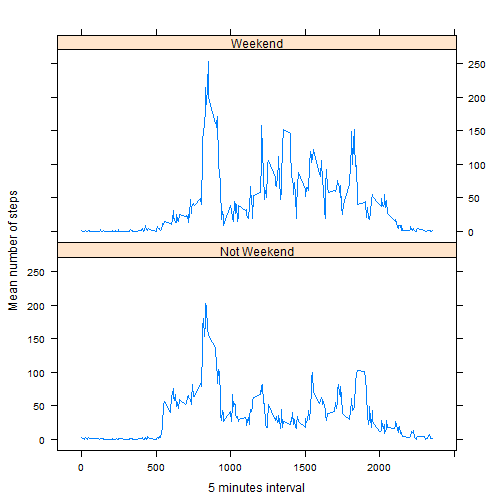

Dear Peer,  
  
thank you for taking the time to review my work.  
  
At this stage of the course I guess you are as passionate about data as I am. It would be great if we could connect through [https://es.linkedin.com/in/andreipopovici](https://es.linkedin.com/in/andreipopovici).   
  
Best regards,  
Andrei 


## (A) Loading and preprocessing the data
### A1. Load the data  
The data file is located [here](https://d396qusza40orc.cloudfront.net/repdata%2Fdata%2Factivity.zip).  
  
The data consists of two months of data from an anonymous individual collected during the months of October and November, 2012 and include the number of steps taken in 5 minute intervals each day.  
  
The variables included in this data set are:  
- steps: Number of steps taking in a 5-minute interval (missing values are coded as NA)  
- date: The date on which the measurement was taken in YYYY-MM-DD format  
- interval: Identifier for the 5-minute interval in which measurement was taken  
  
In the following chunk we will download the zip file, unzip it and read the raw data into RawData dataframe.  

```r
sourceURL="https://d396qusza40orc.cloudfront.net/repdata%2Fdata%2Factivity.zip"
#tempZIP is the temporary variable where we will save our data zip file 
tempZIP<-tempfile()
# download the zip file into temp variable
download.file(sourceURL,tempZIP,mode="wb")
#We will save the unziped acttivity.csv file in the temporary variable tempCSV
tempCSV<-unzip(tempZIP)
#In RawData wi will read our raw data
RawData<-read.csv(tempCSV,stringsAsFactors = FALSE)
#Remove the temporary file created before
rm(tempZIP)
rm(tempCSV)
```

### A2. Process and transform the data
Let's look at the data. We expect 17568 observations and 3 varialbles: steps, date, interval.  

```r
str(RawData)
```

```
## 'data.frame':	17568 obs. of  3 variables:
##  $ steps   : int  NA NA NA NA NA NA NA NA NA NA ...
##  $ date    : chr  "2012-10-01" "2012-10-01" "2012-10-01" "2012-10-01" ...
##  $ interval: int  0 5 10 15 20 25 30 35 40 45 ...
```
  
We observe that their are NA values in steps variable but as indicated in the assigment we will take care of them later. We also see that the date variable is stored as char. In the next chunk we will transform date variable from char to date format.  
  

```r
#We will use lubridate library
library(lubridate)
```

```
## 
## Attaching package: 'lubridate'
## 
## The following object is masked _by_ '.GlobalEnv':
## 
##     second
```

```r
#We will store the dataframe with in a new variable ProcessedData and alwways will keep our original data in the RawData variable
ProcessedData <- RawData
ProcessedData$date <- ymd(ProcessedData$date)
#Let's check our result
str(ProcessedData)
```

```
## 'data.frame':	17568 obs. of  3 variables:
##  $ steps   : int  NA NA NA NA NA NA NA NA NA NA ...
##  $ date    : POSIXct, format: "2012-10-01" "2012-10-01" ...
##  $ interval: int  0 5 10 15 20 25 30 35 40 45 ...
```

***
##(B) What is mean total number of steps taken per day?
First of all we will create a new data frame named StepsXday where we will store the total steps per day done by our subject. We will use dplyr library in order to summarise the data at day level. At this step we will just ignore the NA values.  

```r
# Load the dplyr library
library(dplyr)
```

```
## 
## Attaching package: 'dplyr'
## 
## The following objects are masked from 'package:lubridate':
## 
##     intersect, setdiff, union
## 
## The following objects are masked from 'package:stats':
## 
##     filter, lag
## 
## The following objects are masked from 'package:base':
## 
##     intersect, setdiff, setequal, union
```

```r
# Summarize the totl number of steps per day in the StepsXday variable 
StepsXday<- ProcessedData %>% group_by(date) %>% summarise(total=sum(steps,na.rm=TRUE))
# Calculate the mean of total steps per day
mean(StepsXday$total)
```

```
## [1] 9354.23
```
  
### B1. Make a histogram of the total number of steps taken each day  

```r
# Plotting the histogram of total number of steps per day
hist(StepsXday$total, main="Total steps per day histogram", xlab="Number of total steps during the day")
```

 

```r
# Calculate the mean of total steps per day
mean(StepsXday$total)
```

```
## [1] 9354.23
```

```r
# Calculate the mean of total steps per day
median(StepsXday$total)
```

```
## [1] 10395
```


***
## (C) What is the average daily activity pattern?  
First of all we will create a new data frame named StepsXinterval where we will store the average steps per interval . We will use dplyr library that we already loaded in the previous step. At this step we will just ignore the NA values.  

```r
# Summarize the totl number of steps per interval in the StepsXinterval variable 
StepsXinterval<- ProcessedData %>% group_by(interval) %>% summarise(AverageSteps=mean(steps,na.rm=TRUE))
```
  
### C1. Make a time series plot (i.e. type = "l") of the 5-minute interval (x-axis) and the average number of steps taken, averaged across all days (y-axis)  


```r
# Summarize the totl number of steps per interval in the StepsXinterval variable 
plot(StepsXinterval$AverageSteps~StepsXinterval$interval, type="l", xlab="5-minute Interval", ylab="Average number of steps", main=" Average number of steps time series plot")
```

 
  
### C2. Which 5-minute interval, on average across all the days in the dataset, contains the maximum number of steps?  
  

```r
# Find the observation in StepsXinterval that corresponds to the interval with highest average number of steps 
StepsXinterval[which.max(StepsXinterval$AverageSteps),]
```

```
## Source: local data frame [1 x 2]
## 
##   interval AverageSteps
##      (int)        (dbl)
## 1      835     206.1698
```
    
The interval 835 is the one with the maximum average number of steps: 206.  

***  

## (D) Imputing missing values

### D1. Calculate and report the total number of missing values in the dataset
  

```r
# Calculate the number of rows that have at least one variable NA 
sum(!complete.cases(RawData))
```

```
## [1] 2304
```

```r
# Calculate the numebr of observation with steps variable NA
sum(is.na(RawData$steps))
```

```
## [1] 2304
```

```r
# Calculate the numebr of observation with date variable NA
sum(is.na(RawData$date))
```

```
## [1] 0
```

```r
# Calculate the numebr of observation with interval variable NA
sum(is.na(RawData$interval))
```

```
## [1] 0
```
  
We can conclude now that the missing values are 2304 in the Steps variable.  
  
### D2. Devise a strategy for filling in all of the missing values in the dataset.

In order to fill in these NAs we will use the mean number of steps that we already calculated and stored in the StepsXinterval.  

### D3. Create a new dataset that is equal to the original dataset but with the missing data filled in.
  

```r
# Copy the ProcessedData to CompleteData
CompleteData <- ProcessedData
# To each NA in steps variable we will give the value coresponding to the same interval from thas StepsXinterval that we calculated before
CompleteData[is.na(CompleteData$steps),"steps"] <- StepsXinterval[StepsXinterval$interval %in% CompleteData[is.na(CompleteData$steps),"interval"],"AverageSteps"]
# Let's check that there are no more NAs:
sum(!complete.cases(CompleteData))
```

```
## [1] 0
```
  
  
### D4. Make a histogram of the total number of steps taken each day and Calculate and report the mean and median total number of steps taken per day. Do these values differ from the estimates from the first part of the assignment? What is the impact of imputing missing data on the estimates of the total daily number of steps?
  

```r
# In StepsXdayComplete we will calculate the total number of steps per day with the data in which we filled in the NAs with the means for those intervals
StepsXdayComplete <- CompleteData %>% group_by(date) %>% summarise(total=sum(steps))
# Let's plot a histogram with the complete data
hist(StepsXdayComplete$total, main="Histogram of total number of steps per day with complete data", xlab="Total number of steps per day")
```

 
  
  

```r
# The mean of total numebr of steps per day in the dataset with complete data is 
mean(StepsXdayComplete$total)
```

```
## [1] 10766.19
```

```r
# The median of total numebr of steps per day in the dataset with complete data is 
median(StepsXdayComplete$total)
```

```
## [1] 10766.19
```

```r
# Yes, the mean and the median changed.
# The mean increased by:
mean(StepsXdayComplete$total)-mean(StepsXday$total)
```

```
## [1] 1411.959
```

```r
# The median increased by:
median(StepsXdayComplete$total)-median(StepsXday$total)
```

```
## [1] 371.1887
```
  

***
## (E) Are there differences in activity patterns between weekdays and weekends?
  
For this analysis we will use the ggplot2 package. First we will create a new data frame named StepsXintervalCompleteData where we will summarize the mean number of steps per interval and add a new column which indicates if the observation coresponds to a weekday or weekend.  
  
  

```r
# Create variable StepsXintervalCompleteData which will summarize the mean number of steps by interval for weekend and weekdays
StepsXintervalCompleteData <- CompleteData %>% mutate(type = ifelse(wday(date) %in% c(6,7),"Weekend","Not Weekend"))  %>% group_by(interval,type) %>% summarise(total=sum(steps))
# Load the library ggplot2
library(ggplot2)
# Plot the comparative plot 
qplot(interval, total, data=StepsXintervalCompleteData, colour=type, geom="line")
```

 
  
From the last plot we can conclude that our subject is doing less steps during the weekends. The patterns seem to be similar for the most of the intervals.
